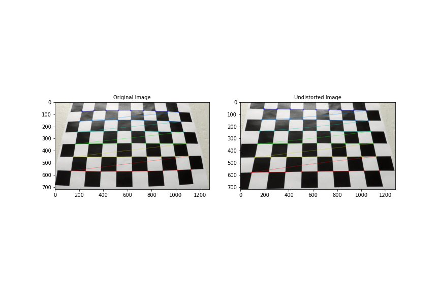
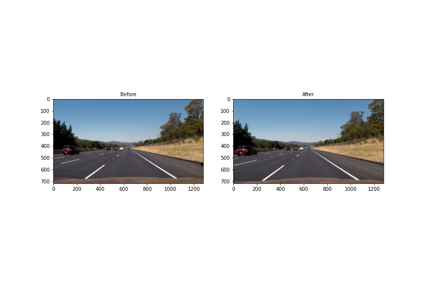
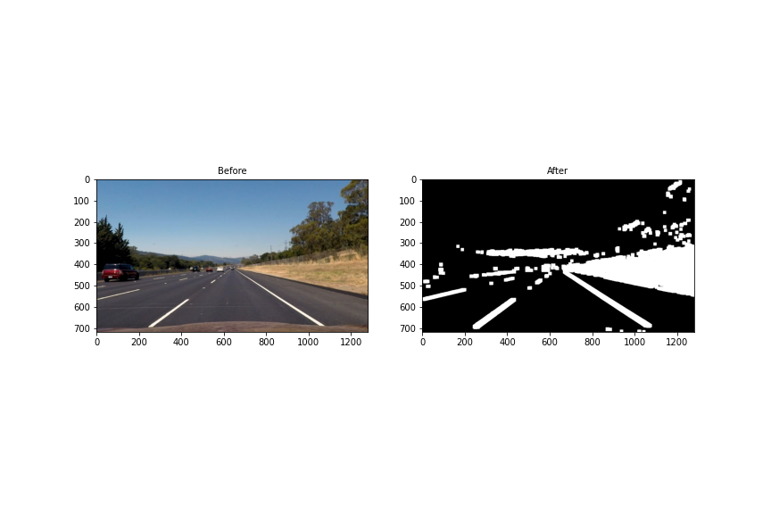
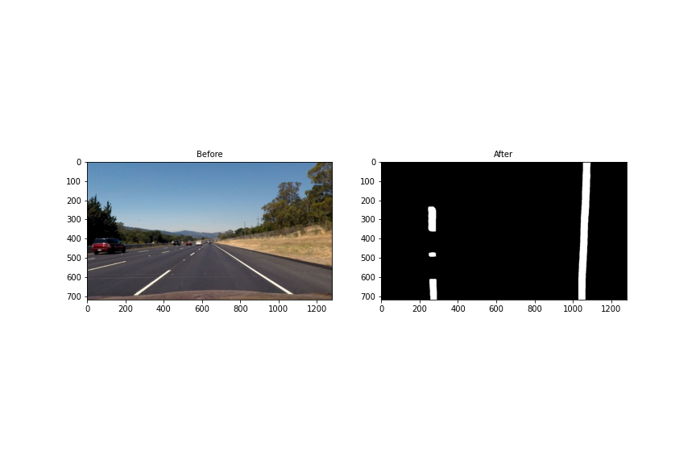
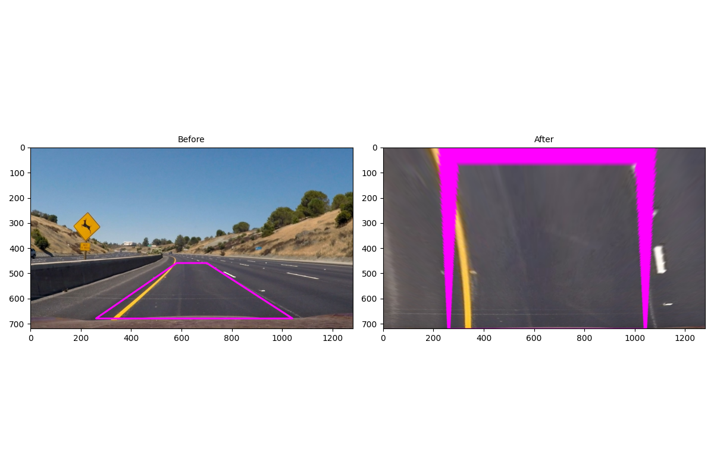
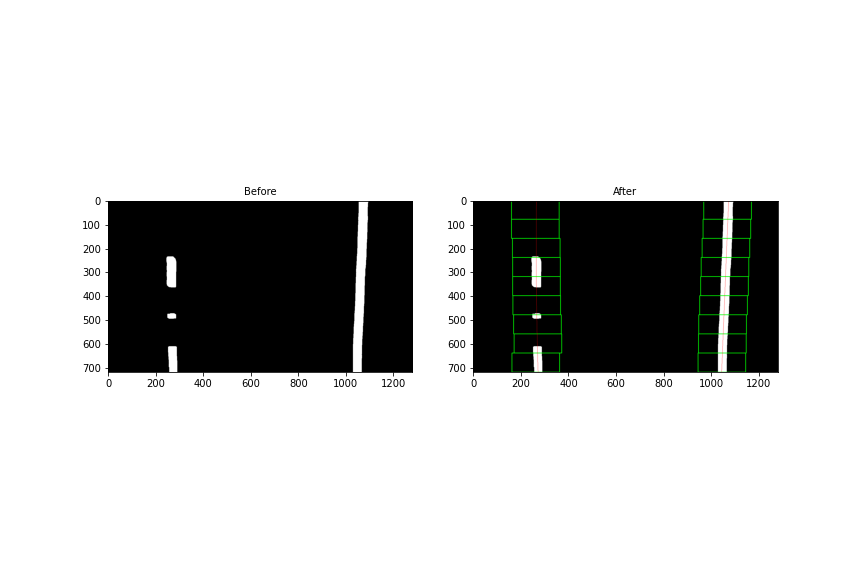
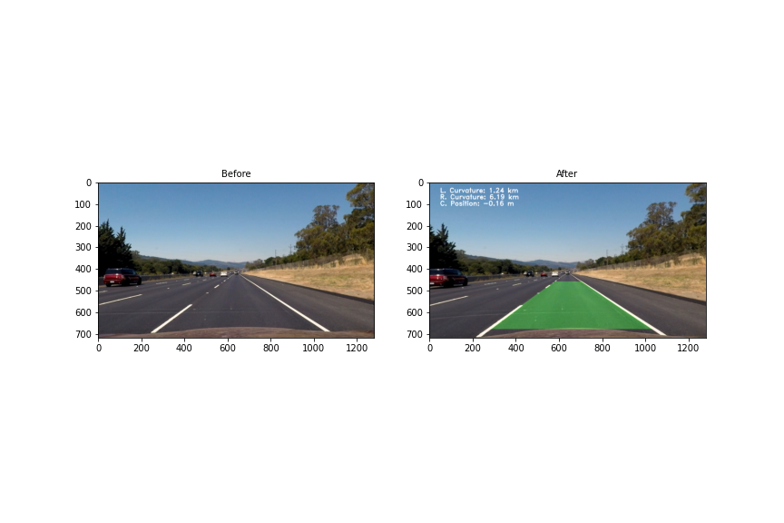

# Advanced Lane Finding

The goal of this project is to find lane lines with the help of a video stream from a dashcam on the front of a car,
 and produce identified lane lines and radius of curvature,. The output is overlayed on the original image :
- The positions of the lane lines 
- The radius of curvature of the road

The processing steps for images include :
1. Camera Calibration and Distortion correction.
2. Color thresholding to identify lane pixel in the image 
3. Warping image with perspective transformation to get birds eye view of the lane lines. 
4. Among all identified pixels find lane line pixels
5. Fit a line in both left lane line and right lane line 
6: Unwarp the detected lane line and superimpose it one original image.
7: Process video frames with queue of size N

### Requirements:
- [Python 3.7](https://www.python.org/)
- [NumPy](http://www.numpy.org/)
- [matplotlib](http://matplotlib.org/)
- [OpenCV](http://opencv.org/)
- [MoviePy](http://zulko.github.io/moviepy/)

Code is designed keeping in mind using OOP, and is separated into several files.
* All camera calibration related code is in file `CamCal.py`
* Raw  Image thresholding processing related code is in file `ProcessImage.py`
* ProcessingPipeline.py is the main driver for the project.
    *   `ProcessingPipeline.process(...)` is the central method for processing which created a pipeline of steps to be performed.
    * There are several other helper function which are describe in details below 

### Step 1: Camera Calibration and Distortion correction.
Often camera have some sort of distortion in the output images, these distortion must be removed before processing.
1. Capture chessboard images from the camera, from multiple angles
2. In these chess images find corner using `opencv- cv2.findChessboardCorners`. These corner are helpful for the 
algorithm to find lines and remove distortion effects.
3. Using these corner points user opencv function `calibrateCamera` to compute distortion coefficient and calibration matrix
4. Save <i>distortion coefficent</i> and <i>distortion matrix</i> to distort all images.
5. Distortion is specially visible around the edges and corner of image.   

Above Figure show comparision between distorted and undistorted chess board images using camera
calibration technique. Multple files have been calibrate and can be found in folder 
 `output_images/caliber_undist_img`
 
Removing distortion from images of lane lines is show in image below.
 
 Code for camera calibration can be found in CamCal.py: function `caliberate(...)`

### Step 2: Color Thresholding.
This Step involves converting color images to binary pixel image where pixel value of 1 is pixel of interest and can
 potential lane lines. Image is converted to several color spaces like HSV and HLS for specific parts.
 1. Convert RGB image to HLS and HSV color space.
    1. Extract L and S channel from HLS, Compute gradients on L and S Channel and binarize binarize if pixel value is between threshold
    2. Compute Gradients of R Channel as it sensitive to yellow and binarize if pixel value is between threshold
    3. Create Color mask of yellow and white thresholding on HSV space and identify area which have white or yellow pixels.
2. Gradients on raw pixel is noisy, so use median blur to remove noise, this removes salt and pepper noise from images.
3. Use box filter to enlarge area around pixel points.
4. A logical and is computed between all the gradient processed image
5. Apply color mask to computed gradient image to achieve final binary image.

Above image show the image after thresholding. Other examples of image thresholding can be found in folder `output_images/step2`

Code for Image thresholding can be found in ProcessImage.py: class function `ProcessImage.pipeline(...)`

### Step 3: Perspective Transformation.
This steps transform our area of interest which is polygon around which we expect lane lines to be, usually lower half of the image.
1. Extract 4 points around region of interest convert it into a top down view, also called birds eye view.
2. Using these points warp the image such that the lane lines appear to be parallel to each other.
3. OpenCV functions `getPerspectiveTransform` and `warpPerspective` to warp the images and save the transformation matrix
 

Above image show the lanes lines after perspective transformation. The lanes lines appear to be relatively parallel than converging before.
More of the processed warped lines can be found in folder `output_images/step3/`

Code for Perspective transformation can be found in ProcessingPipeline.py: class function `ProcessingPipeline.get_birds_eye(...)` 

### Step 4: Applying Binary Thresholds
Instead of applying threshold to the complete image, allpying threshold to warped bird eye view of lanes lines makes more sense
Thus I apply thresholding to just warped images and obtain activated pixels for the lane lines

More of these processed images can be found in folder `output_images/step4/`

### Step 5: Fitting lines to activated pixels 
Usually binarized image of birds eye view have two major activation peaks along the X axis,
around position of left and right lane. Goal os this step is to start with the base of image 
and find activated pixel using sliding window from bottom of the image to top 

1. Find the histogram of activated pixel along X axis, usually it is an bimodal distribution 
depicting left and right lane lines
2. Left peak usually is the starting x point of left lane, right peak is for right lane.
3. Search space in image is optimized using search around histogram peaks in x axis and searching 
in N window across Y-Axis 
3. For the first window Starting from the index of the peak we search around the a window of N pixels around the 
central point to find other activated pixels add them to tracking list,
4. I shift the window center based in the number of points and their mean so as to approximate 
points center near actual means.
5. Cover all image using N window to find all activated pixel points.
6. Using these pixel points as training data, I train a 2nd order regression model to fit Y axis
to X axis. With the help of model parameters, compute the best fit line across these activated points
7. Two Line objects are created for lane points are added to best fit is computed. Refer method `Lines.add_points(...)` 
for detailed fitting of lines
8. Radius of curvature was calculated and converted to metric system using `Line.calc_radius(...)` method
10. Center point is calculated in the `ProcessingPipeline.process(...)`

Image above show all the N window used to find activated pixel. Read line passing through the 
center in the green boxes are the lane lines.
More of these processed images can be found in folder `output_images/step5/`

Code for this part can be section is in ProcessingPipeline.py: class function `ProcessingPipeline.find_lane_pixel_window(...)`
 and `ProcessingPipeline.process(...)`

### Step 6: Putting it all together
After finding the lane line from the step 5, we can unwarp using reverse perspective transform 
the line pixel position to actual image pixel position
1. Inverse perspective transformation to get line pixel location in unwarped images.
2. Over lay this line and fill space between the to indicate lane markings. 
3. Over lay radius of curvature and center point on the image

More of these processed images can be found in folder `output_images/step6/`

Code for this part can be section is in ProcessingPipeline.py: class function `ProcessingPipeline.draw_result(...)`
 and `ProcessingPipeline.process(...)`

## Video Processing Pipeline:
While processing image we can use model learned from previous image frame to find the best fir line in the current frame
the assumption is that there will not be any drastic change from frame to frame. the transition in turing will be smooth

1. For the first frame compute lane lines using n window method describe above. If lane lines are not found use 1/4 of x for left center
and 3x/4 for right center (just an approximation until we find good pixel to track). Push the model in a deque ( Line.recent_xfitted)
2. This deque is maintained to be of size 15 (found with trail and error). Once we reach 15 we pop from the front and push from back.
3. Trained model is pushed into queue. This trained model is only trained on new points.
4. Best model is average of the past models and the current model.
5. If we fail to find points around the previous model, we again go back to sliding window for the current frame and fit that to get model
6. Computing average of past N frame provides smooth transition in turns

|Project Video|Challenge Video|
|-------------|-------------|
|||

### Possible Limitations:
The video pipeline developed in this project did a fairly robust job of detecting the lane lines in the test video
 provided for the project, which shows a road in basically ideal conditions, with fairly distinct lane lines, and on a clear day. 
It also did a decent job with the challenge video, although it did lose the lane lines momentarily when there was heavy 
 shadow over the road from an overpass. 
Lot of handing tuning of thresholds and parameter to make the system work in all the scenarios
Model does not perform well on slopes, and large occlusions may be due to assumption in perspective transformation that the surface is flat

